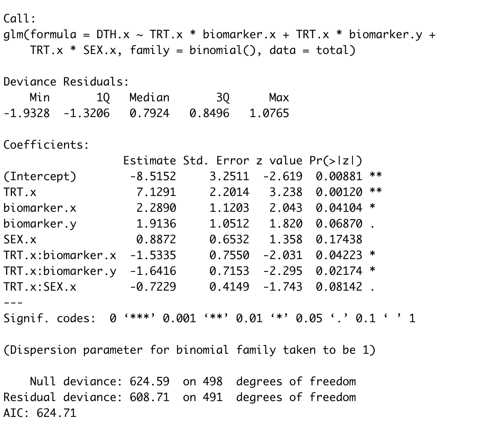
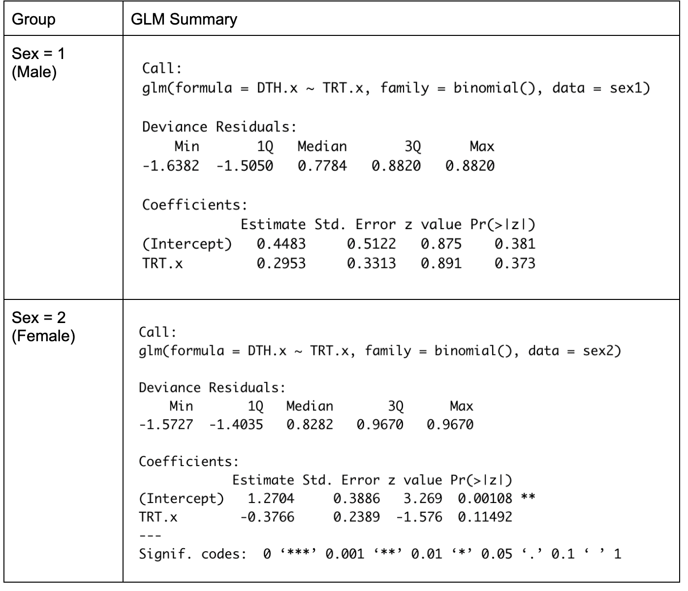
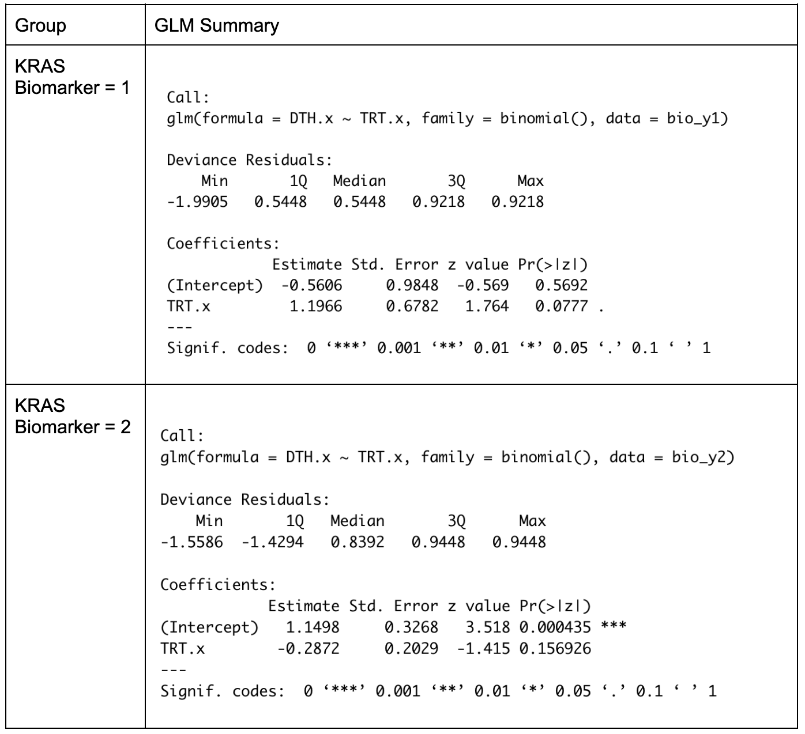
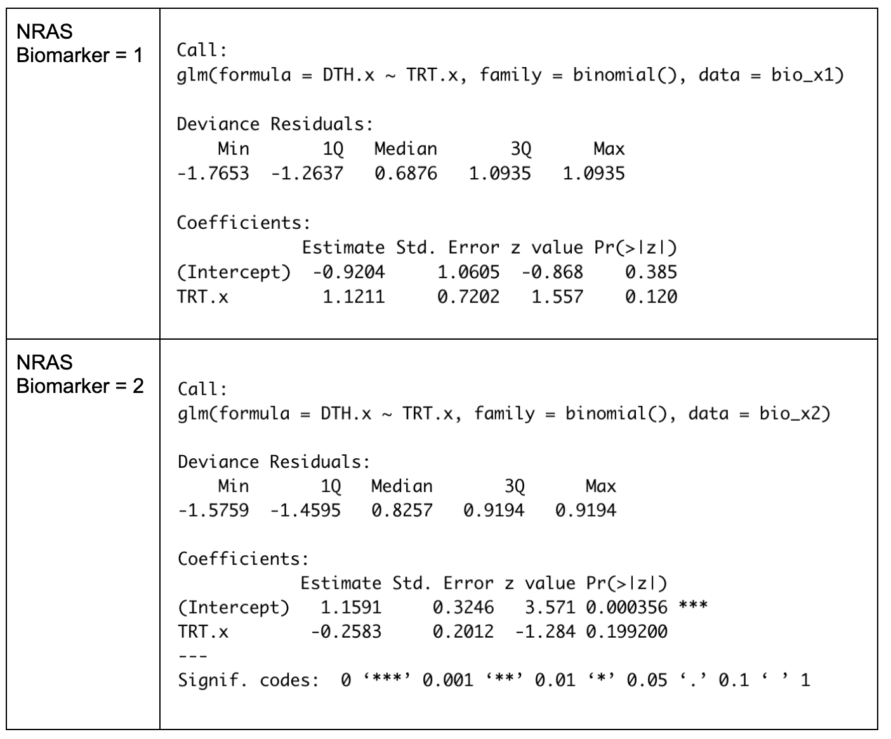
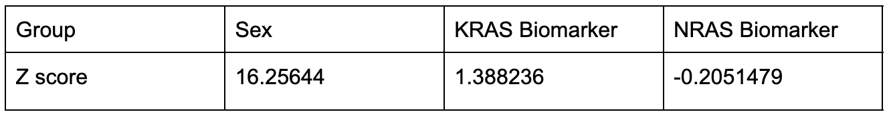
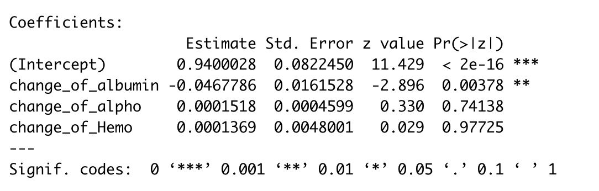
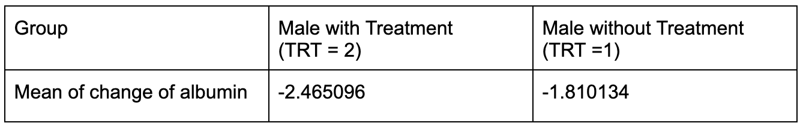

```{r setup, include = FALSE}
knitr::opts_chunk$set(
  collapse = TRUE,
  comment = "#>"
)
```

## **BIS 620 (FA22): Data Science Software System**

# **Panitumumab in combination with Oxaliplatin/ 5- fluorouracil/ Leucovorin Analysis on Untreated Metastatic Colorectal Cancer**

## **Group Member (Net ID):**

### **Wenxing Wang (**ww442**)**

### **Xinyi Di (**xd85**)**

### **Yaoqi Li (**yl2424**)**

## **Yale University School of Public Health**

## 1. Background

Colorectal cancer continues to be the second leading cause of cancer-related death in the United States. In 2014, 136,830 individuals in the U.S. will be diagnosed with colorectal cancer, and 50,310 of them will die because of this disease. Even though there are some advancements in screening procedures and the use of adjuvant therapy, approximately 50% of patients with colorectal cancer eventually will develop metastatic colorectal cancer. 

The current treatment for metastatic colorectal cancer is a combination of cytotoxic therapy. First-line treatments include infusional fluorouracil(5-fluorouracil), leucovorin, and oxaliplatin (FOLFOX). For decades, 5-fluorouracil was the only available drug for colorectal cancer; hence, numerous trials were performed that used various administration schedules and modulating agents to improve therapeutic efficacy. The addition of leucovorin to 5-FU improves response but not survival. (1-2) 

## 2. Motivation

To better understand the FOLFOX and to improve the effects of the therapy for metastatic colorectal cancer, our group analyze the dataset provided by the Project Data Sphere. From our previous study(BIS620 HW2), we find that the treatment of Panitumumab in combination with FOLFOX does not significantly change the survival rates of metastatic colorectal cancer patients, compared to the treatment of FOLFOX alone. However, we recognize that one of the intrinsic factors, the biomarker KRAS mutations in exons 3, 4, and 5 have a relationship with death. Moreover, we think the treatment of FOLFOX+Planitumumab does not have a direct relationship with death but it may affect the change of lab standards and this will provide useful information for the further study of the therapy. Also, the lab standards are correlated to colorectal cancers: for example, albumin is a prognostic indicator in patients with colorectal cancer; alkaline phosphatase and lactate dehydrogenase are related to cell metabolism, and the metabolism of cancer cells is generally much higher than that of normal cells; colorectal cancer cells correlates closely with tumor resistance to activated killer cells, by inhibiting cytolysis, activated killer cell infiltration, and activated killer cell adherence to colorectal cancer. (3-4)

## 3. Research Question

Therefore, in this study, we propose a research question on a randomized controlled study that, among patients with metastatic colorectal cancer, does the intrinsic factors such as biomarker mutations of NRAS and KRAS, age, race, and sex, in management of FOLFOX with Panitumumab and FOLFOX alone, make a difference in the death; if so, does the intrinsic factors have influences on the change of lab standards such as albumin, alkaline phosphatase, and lactate dehydrogenase, etc. and how they may affect the death of colorectal cancer. After analyzing the dataset, we may find some underlying relationships of intrinsic factors, lab standards, treatments of FOLOX+Panitumumab and FOLOX alone, and death, we will learn more about the therapy of colorectal cancer.

## 4. Method

*Database and tools:* In our study, we apply datasets of the panitumumab clinical trials from Project Data Sphere, a platform for cancer patients by openly sharing data, convening world-class experts, and collaborating across industries. This dataset contains information from a randomized, multicenter, phase 3 study to compare the efficacy of panitumumab in combination with FOLFOX and FOLFOX Alone in patients with previously untreated metastatic colorectal cancer. Specifically, we focus on 3 tables: ADSL which contains basic information about each participant such as age, sex, weight, death or not, etc., ADLS that includes information on eight lab test standards of each patient measured on multiple visit days, and BIOMARK that contains the mutation status of several biomarker genes. For these tables, we use RStudio with version 4.2.1 to read, process, and analyze the data. 

\
*Data Process:* First, we use the ADLB table and want to find the change in the eight lab standards on each patient. For each lab standard, we find the largest visiting day for each patient and then get the value of the lab standard of the maximum visiting day. Also, we don't want the maximum visiting day to be the same as the baseline and exclude these data points, because there is no change in the lab standard and will make no contribution to the analysis. Then, we use the flag of baseline to find the baseline value of the lab standard and use the value of maximum day to subtract it to get the output of the change of lab standard. We apply these functions to the eight lab standards and create a big table including all of them. Also, we join this big table of lab standards with ADSL by subject_ID and include the result of death as a new variable. Moreover, for the NRAS biomarker mutations, we apply the BIOMARK table and select the NRAS mutations in exons 2, 3, and 4 and calculate their mutant type by the following rules: A patient will be considered "Mutant" if there is at least one "Mutant" biomarker in NRAS exons 2, 3, or 4. Patients will be considered "Wild-type" if they are not "Mutant" and they have more "Wild-type" markers than "Unknown" or "Failure". Also, this new NRAS mutation table has the subject_ID and is used to join with the ADSL to include useful information such as the result of death. Later, we conduct models and calculations on these prepared tables.

## 5. Analysis and Result

### 5.1 **Intrinsic factors analysis**

Through experiments on various combinations of different intrinsic factors, we selected sex, KRAS biomarkers, and NRAS biomarkers as the intrinsic factors in this study, using a GLM model.

The results are shown in the table below:

```{r echo=FALSE, out.width = "30%", fig.align = "center"}

```

After fitting the GLM model using different variables in datasets multiple times, we selected the variables with the lowest Pr(\> \|z\|), which indicates high statistical significance. 

From the table above, we observe SEX, TRT.x:biomarker.x (stands for interaction (possible association) between treatment and NRAS biomarker), TRT.x:biomarker.y (stands for interaction (possible association) between treatment and KRAS biomarker) are the three most interpretable variables with the highest significance.

### 5.2 **Control test analysis**

In this step, we aimed to conduct control tests to explore how treatment influences the death rate in different groups. Here, the groups are divided by different categories in selected intrinsic factors. 

Take "SEX" as an example. We have two groups, where SEX =1 (male) and SEX =2 (female). We worked toward seeing the difference of the impact on the death rate generated by treatment between the two groups.

We are going to use both GLM and z tests to investigate the relationship between treatment and death rate.

### 5.2.1 GLM

Results are shown in table below:

### 5.2.1.1 Sex

```{r echo=FALSE, out.width = "30%", fig.align = "center"}

```

### 5.2.1.2 KRAS biomarker

```{r echo=FALSE, out.width = "30%", fig.align = "center"}

```

### 5.2.1.3 NRAS biomarker

```{r echo=FALSE, out.width = "30%", fig.align = "center"}

```

### 5.2.2 Z tests

```{r echo=FALSE, out.width = "30%", fig.align = "center"}

```

Given the above results, we have an overview about the how patients in different groups in each intrinsic factors react to treatment.

### 5.3 **Lab Standard Analysis**

In this step, we applied GLM (Input: change of each lab standard, Response: Death), in order to learn how each lab standard influences the death rate. By analyzing the results, we picked **albumin** as the most important lab standard that affects the death rate.

```{r echo=FALSE, out.width = "30%", fig.align = "center"}

```

### 5.4 **Deep Dive**

From the studies above, we noticed that sex, treatment, and albumin have a strong impact on the death rate.

Particularly speaking, in the GLM model in 2.a.i, we noticed that the treatment on the male group increases the death rate (the coefficient is positive) while the treatment of females decreases the death rate (the coefficient is negative). And in the lab standard analysis, we observed albumin lowers the death rate. These observations drove us to find out if treatment on males influences the albumin level in patients' bodies and then influences the death rate.

Therefore, we selected male patients from the dataset and divided them into two groups (one with treatment, and one without treatment). Then, we calculate the mean of the change of albumin in each group.

The results are listed below:

```{r echo=FALSE, out.width = "30%", fig.align = "center"}

```

From this table, we see treatment contributes to a stronger decrease in albumin level compared to non-treatment. As we have already known, albumin reduces death. Thus, more decrease in albumin level results in a higher death rate. This could possibly explain why the treatment of male patients increases the death rate as we found in the previous analysis. 

## 6. Limitation

One limitation is that in the data processing part, we calculated the change in the lab standards by using the difference between the baseline and the maximum visiting days. However, some of the participants have a long follow-up time but some of them only have a few days and we have not considered the effect of the length of the days. Also, when we calculate the mutation types for KRAS, we recognize that the number of "Wild-type" is greatly smaller than the "Mutant" and it may affect the result. 

## 7. Conclusion and Future Work

In this studies, we have come to a preliminary conclusion that albumin level plays an important role in human's death rate. Individuals who died generally had a much lower albumin level than those who survived.

In addition to an overview of albumin's impact on human-beings, we then tie back to our studies: the treatment. We concluded that while treatment may probably significantly lead to a decrease in albumin level in females, there is almost no difference in males.

To further validate our conclusion and make it actionable, we can conduct more research on:

1.  How albumin works to affect human's death rate?
2.  Why treatment results in different albumin level in males and females?
3.  How to improve albumin level in males (maybe a higher dose of vaccination, a longer course of treatment, etc) ?

## 8. Reference

1.  Fakih, Marwan G. "Metastatic colorectal cancer: current state and future directions." Journal of clinical oncology 33.16 (2015): 1809-1824.

2.  Kindler, Hedy Lee, and Keith L. Shulman. "Metastatic colorectal cancer." Current treatment options in oncology 2.6 (2001): 459-471.

3.  Heys, S. D., et al. "Serum albumin: a prognostic indicator in patients with colorectal cancer." Journal of the Royal College of Surgeons of Edinburgh 43.3 (1998): 163-168.

4.  Goldstein, Mitchell J., and Edith Peterson Mitchell. "Carcinoembryonic antigen in the staging and follow-up of patients with colorectal cancer." Cancer investigation 23.4 (2005): 338-351.

5.  Douillard, Jean-Yves et al. "Panitumumab-FOLFOX4 treatment and RAS mutations in colorectal cancer." The New England journal of medicine vol. 369,11 (2013): 1023-34. <doi:10.1056/NEJMoa1305275>
